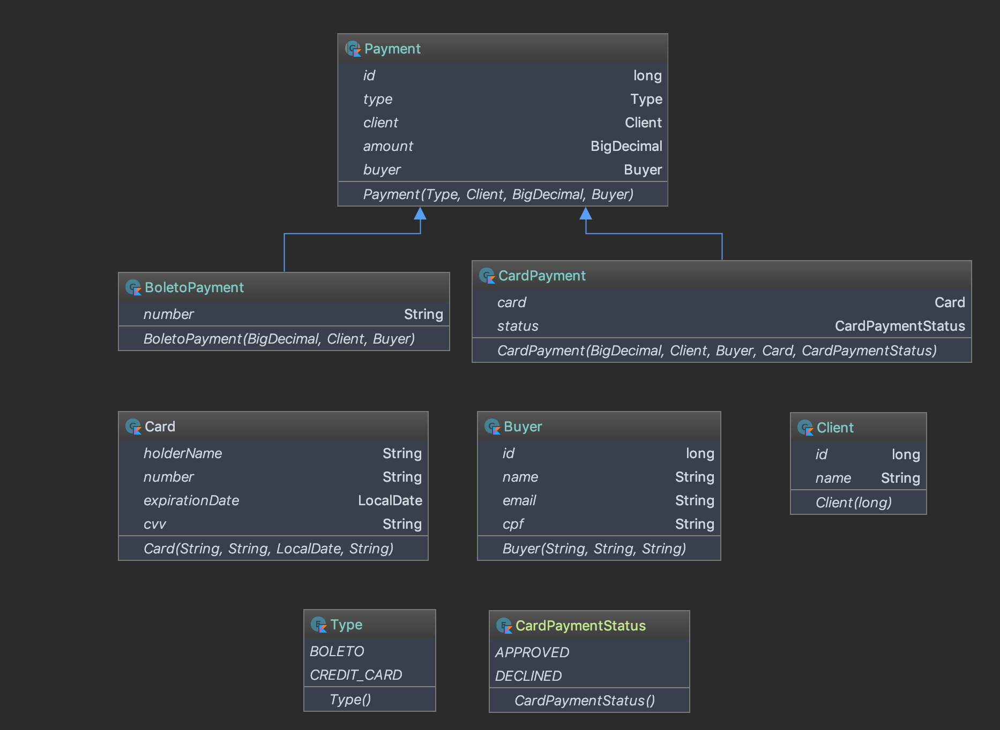

```
  __  __    ___    ___   ____       ____   _   _      _      _       _       _____   _   _    ____   _____
 |  \/  |  / _ \  |_ _| |  _ \     / ___| | | | |    / \    | |     | |     | ____| | \ | |  / ___| | ____|
 | |\/| | | | | |  | |  | |_) |   | |     | |_| |   / _ \   | |     | |     |  _|   |  \| | | |  _  |  _|
 | |  | | | |_| |  | |  |  __/    | |___  |  _  |  / ___ \  | |___  | |___  | |___  | |\  | | |_| | | |___
 |_|  |_|  \___/  |___| |_|        \____| |_| |_| /_/   \_\ |_____| |_____| |_____| |_| \_|  \____| |_____|
```
[](https://circleci.com/gh/marioalvial/moip-challenge/tree/master)
[](https://bettercodehub.com/)
[](https://codecov.io/gh/marioalvial/moip-challenge)

Technical challenge for Moip selective process

## Requirements

For building and running the application you need:

- [Gradle](https://gradle.org/)
- [Docker](https://www.docker.com/)

## Documentation
[Postman](https://documenter.getpostman.com/view/2673922/RVnZhyTK)

## Running

First, clone the project:

```shell
git clone https://github.com/marioalvial/moip-challenge.git
cd moip-challenge
```
#### Running with docker


```shell
./gradlew build && docker-compose up --build
```

#### Running locally 
Configure data source in application.yml:

```
spring:
  datasource:
    driver-class-name: com.mysql.jdbc.Driver
    url: dbc:mysql://localhost:{YOUR_PORT}/{YOUR_DB_NAME}
    username: {YOUR_DB_USERNAME}
    password: {YOUR_DB_PASSWORD}
```
If your port is 3306 and your database doesn't have password you can omit them

## Continuous Integration and Test Coverage

Continuous Integration is configured on CircleCI. Checkout the [continuous integration here](https://circleci.com/gh/marioalvial/moip-challenge)

##  Testing

```shell
./gradlew test
```

## Diagram



## Built With

- [Kotlin](https://kotlinlang.org/) - Programming language
- [IntelliJ](https://www.jetbrains.com/idea/) - IDE
- [Spring](https://spring.io/) - Java Framework
- [Gradle](https://gradle.org/) - Dependency Management
- [Docker](https://www.docker.com/) - Containerization Platform
